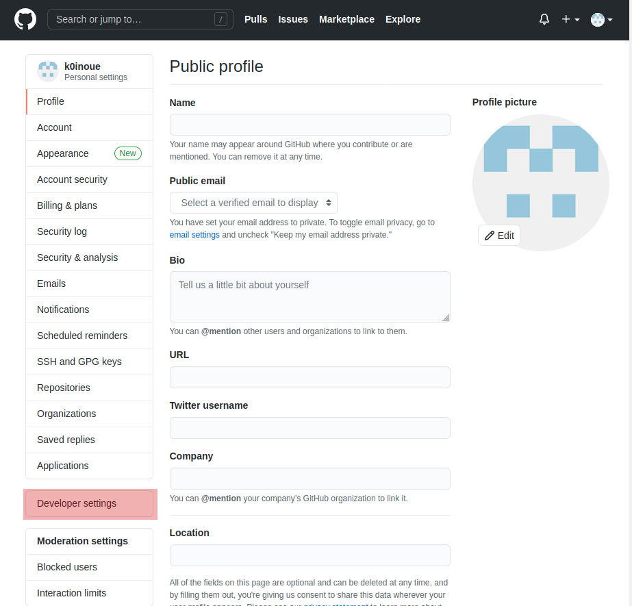
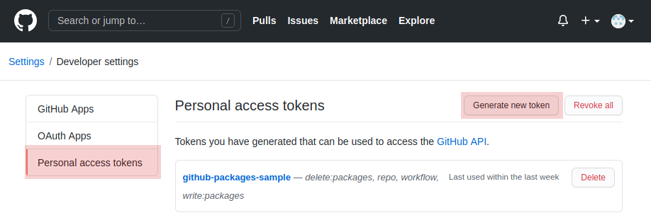
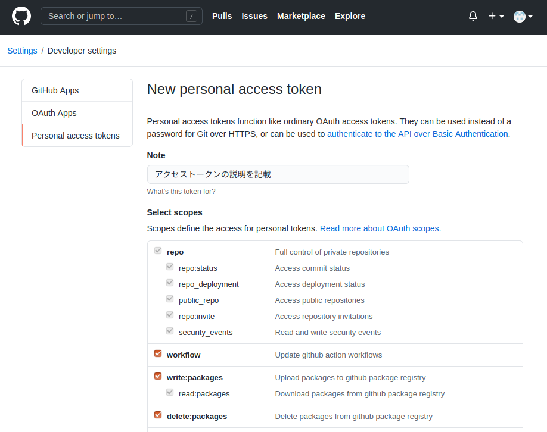
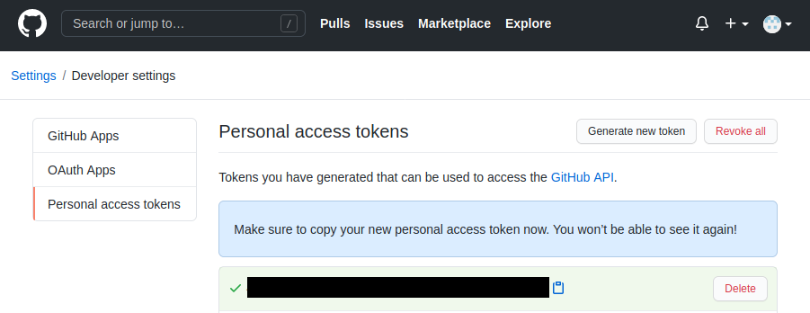

# github-container-registry-sample

<!-- START doctoc -->
<!-- END doctoc -->

GitHub Container RegistryにDockerのイメージを登録して利用するサンプルプロジェクト。

下のGitHub Packagesを利用するリポジトリをGitHub Container Registryに変更したもの。

[https://github.com/k0inoue/github-packages-sample]

## GitHub Packagesとの違い
GitHub PackagesとGitHub Container Registryの主な違いは以下。
詳細は[こちら](https://docs.github.com/en/free-pro-team@latest/packages/guides/migrating-to-github-container-registry-for-docker-images#key-differences-between-github-container-registry-and-the-docker-package-registry)を参照されたし。

- 権限設定を細かく決められる
- GitHub Container Registryにpushしたものは、匿名ユーザーでもpullできる
- GitHub Actions上でもGitHub Container Registryからpullできる
  - GitHub Actions上では、GitHub Packagesからpullできなかった
- レジストリのドメインが違う
  - GitHub Packages:　docker.pkg.github.com/OWNER/REPOSITORY/IMAGE_NAME
  - GitHub Container Registry:　ghcr.io/OWNER/IMAGE_NAME
- GitHub Actionsでdocker login する場合は、Personal access tokensが必須になる
  - GitHub Packagesでは、GITHUB_TOKENが使えたので不要だった
- プレビュー版の機能の為、GitHub上の設定で機能を有効にしないと使えない


## 注意点

本リポジトリをforkして試す場合は、以下の点に注意。

-「Improved container support」を有効にすること(後述の手順概略の「1. 事前設定」の1)
- アクセストークンを生成しておくこと(後述の手順概略の2)
- `cmd/config.sh`の`GITHUB_USER`を各自のGitHubアカウント名に変更すること
  - アカウント名は全て小文字で記載すること
- 生成したPersonal access tokenの値をGitHubのsecret変数（CR_PAT）として追加登録しておくこと
- pushした`gpack-base`イメージは、[こちらの手順](https://qiita.com/zembutsu/items/1effae6c39ceae3c3d0a)に沿ってpublicに変更する必要がある
  - 上記手順を行わない間は、GitHub Actionの`gpack-custom`のビルドで失敗する（はず）


## 手順概略
GitHub Container RegistryでDockerのイメージを利用する大まかな手順は以下となる。

### 1. 事前設定

1. [こちらの手順](https://docs.github.com/en/free-pro-team@latest/packages/guides/enabling-improved-container-support)に沿って「Improved container support」を有効にする
2. [後述の手順](#personal-access-tokensの生成)に従って、GitHubのPersonal access tokensを生成して保存しておく
    - 以下のスコープにチェックを入れること
        - write:packages
        - read:packages
        - delete:packages
  

### 1. 手動ビルド＆プッシュ＆プル手順

基本的に通常のdockerと同じ流れとなる。

1. `docker build`でイメージを作成する
2. `docker login`でGitHubにログインする
3. `docker tag`で作成したイメージにタグ付けをしてリポジトリとも紐付ける
4.  `docker push`でリポジトリへイメージをアップロードする
5.  `docker pull`でリポジトリからイメージを取得する

ただし、[後述](#dockerコマンドによる操作)のようにdockerコマンドのlogin/push/pullの際に指定するレジストリは`ghcr.io`となる。

pushしたパッケージは、以下のページから確認できる。（「GitHubアカウント名」は各自のアカウント名に置き換えること）

```
https://github.com/GitHubアカウント名?tab=packages
```

もし、pushしたDockerイメージを誰でも`docker login`なしで`docker pull`できるようにしたい場合は、[こちらのサイト](https://qiita.com/zembutsu/items/1effae6c39ceae3c3d0a)を参考に、`gpack-base-manual`をpublicにする必要がある。
（「アップロードしたイメージを確認するには、〜」移行の手順を参照）

本プロジェクトでは、便宜上、cmdディレクトリ以下に上記を操作を行うスクリプトを用意している。


### 3. 自動ビルド＆プッシュ手順

本リポジトリでは、以下のファイルをGitHubにpushした際に、GitHub Actionsで`docker build`と`docker push`を行うようになっている。  

- `docker/base/**`
- `docker/custom/**`
- `.github/workflows/docker-publish.yml`

ただし、forkした場合は、以下の手順を最初に行う必要がある。

1. [1. 事前設定]で生成したPersonal access tokenの値をGitHubのsecret変数として追加登録する
   - 追加方法は[こちらの手順](https://docs.github.com/en/free-pro-team@latest/actions/reference/encrypted-secrets#creating-encrypted-secrets-for-a-repository)を参照
   - 本リポジトリでは追加する変数名は「CR_PAT」とする
   - 追加した変数はGitHub Actions用の`.github/workflows/docker-publish.yml`で`docker login`の際に参照している
2. GitHubへ`.github/workflows/docker-publish.yml`を修正して一度pushする
   - もし、fork先のアカウント名に大文字が含まれている場合は、`${{ github.repository_owner }}`を全て小文字のアカウント名に置き換える
   - もし、fork先のアカウント名に大文字が含まれていない場合は、空行を追加する（何かしらのpushできる修正ならOK）
   - push後に動き出すGitHub Actisonsの処理は、一度pushしてgpack-baseの次の手順を行うまでの間は失敗する
3. GitHub Actionsでpushした`gpack-base`イメージをprivateからpublicに変更する
   - [こちらの手順](https://qiita.com/zembutsu/items/1effae6c39ceae3c3d0a)に沿ってpublicに変更する


## ファイル構成
本リポジトリのファイル構成は以下となる。

```
github-container-registry-sample/
|-- .github/workflows       サンプルのDockerプロジェクト
|   |-- docker-publish.yml    GitHubへのpush時にイメージをDocker build & push
|-- .gitignore
|-- LICENSE
|-- README.md
|-- docker                  サンプルのDockerプロジェクト
|   |-- base                ベースイメージ作成用
|   |   |-- Dockerfile
|   |-- custom              ベースからの派生イメージ作成用
|   |   |-- Dockerfile
|-- cmd/
|   |-- build.sh            Dockerビルドスクリプト
|   |-- config.sh           シェルスクリプト共用設定ファイル
|   |-- login.sh            GitHubへのログインスクリプト
|   |-- pull.sh             GitHubからイメージをpullするスクリプト
|   |-- push.sh             GitHubへのイメージをpushするスクリプト
```

リポジトリとは別に、アクセストークンを保存したファイルを以下に置いている想定。

```
$HOME/
|-- .github-token       GitHub Packagesにアクセスするためのトークン(各自用意)
```

## Personal access tokensの生成

[こちらのページ](https://github.com/settings/tokens)から以下の手順に沿って、GitHubのPersonal access tokensを生成する。

### 1. \[Develops settings\]をクリック
---



<br />


### 2. \[Personal access tokens\] --> \[Generate new token\]をクリック
---



<br />


### 3. \[Select scopes\]で権限設定
---

以下にチェックを入れて、ページ下部にある、\[Generate token\]をクリック。

- write:packages
- read:packages
- delete:packages



<br />


### 4. 生成されたトークンを保存
---

生成されたトークン(下の画像の黒塗り部分)をコピーして、`$HOME/.github-token`に保存する。




念の為、自分以外は読み書きできない権限に変更しておく。

```
chmod 600 $HOME/.github-token
```


## Dockerコマンドによる操作

各手順のdockerコマンドは以下の通り。
本リポジトリでは、以下のコマンドをまとめた簡略用シェルスクリプトを作成している。

```
# ビルド
docker build -t ローカルのイメージ名 -f ビルドするDockerfileパス .

# ログイン
cat $HOME/.github-token | docker login ghcr.io --username GitHubユーザ名 --password-stdin

# タグ付け
docker tag ローカルのイメージ名 ghcr.io/GitHubユーザ名/配布パッケージ名:タグ

# アップロード(push)
docker push ghcr.io/GitHubユーザ名/配布パッケージ名:タグ

# ダウンロード(pull)
docker pull ghcr.io/GitHubユーザ名/配布パッケージ名:タグ
```

Dockerfile内で指定する場合は以下となる。

```
FROM ghcr.io/GitHubユーザ名/配布パッケージ名:タグ
```


## 簡略用シェルスクリプト

本プロジェクトでは、便宜上、cmdディレクトリ以下に上記を操作を行うスクリプトを用意している。  
（forkしない場合、cmd/pull以外は動かない）

forkしたリポジトリで使用するには、事前に設定ファイル（`cmd/config.sh`）を修正する必要がある。

### 簡略用シェルスクリプト用の設定ファイル
---

以下の変数を`cmd/config.sh`で設定しており、各スクリプトから読み込んでいる。
プロジェクトに合わせて設定すること。

```
# GitHubのユーザ名(リポジトリパスに含まれる。全て小文字にすること)
GITHUB_USER=k0inoue

# Dockerイメージを登録するレジストリのURL
REGISTRY_ROOT=ghcr.io
REGISTRY_URL=${REGISTRY_ROOT}/${GITHUB_USER}

# 配布パッケージ名(Dockerのイメージ名となる)
PACKAGE_NAME=gpack-base-manual

# GitHubのPersonal access tokensを保存したファイルのパス
GITHUB_TOKEN_FILE=${HOME}/.github-token

# ビルドするDockerfileパス
DOCKER_FILE_PATH=docker/base/Dockerfile
```

### スクリプトの実行
--- 

プロジェクトのルートディレクトリに移動して、以下を実行。
(各スクリプトは`chmod +x cmd/*.sh`などで実行権限を追加しておくこと)

```
cmd/build.sh  [<タグ>]      # Dockerfileをビルドする
cmd/push.sh   [<タグ>]      # ログインして、タグ付けして、pushする
cmd/pull.sh   [<タグ>]      # イメージをpullする
cmd/login.sh                # docker login コマンドでgithubにログイン
```

タグを省略すると、`latest`になる。


## 派生イメージ(docker/custom/Dockerfile)のビルド実行例

本リポジトリのルートディレクトリで以下のコマンドを実行する。

```
docker build . -f docker/custom/Dockerfile -t gpack-custom-manual

```

